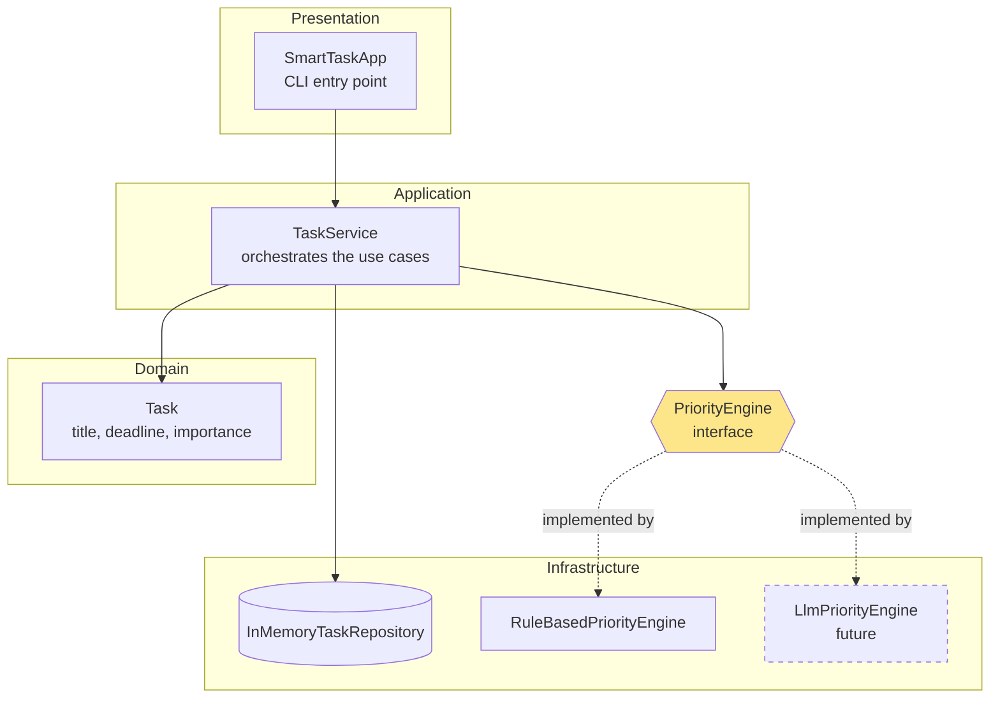
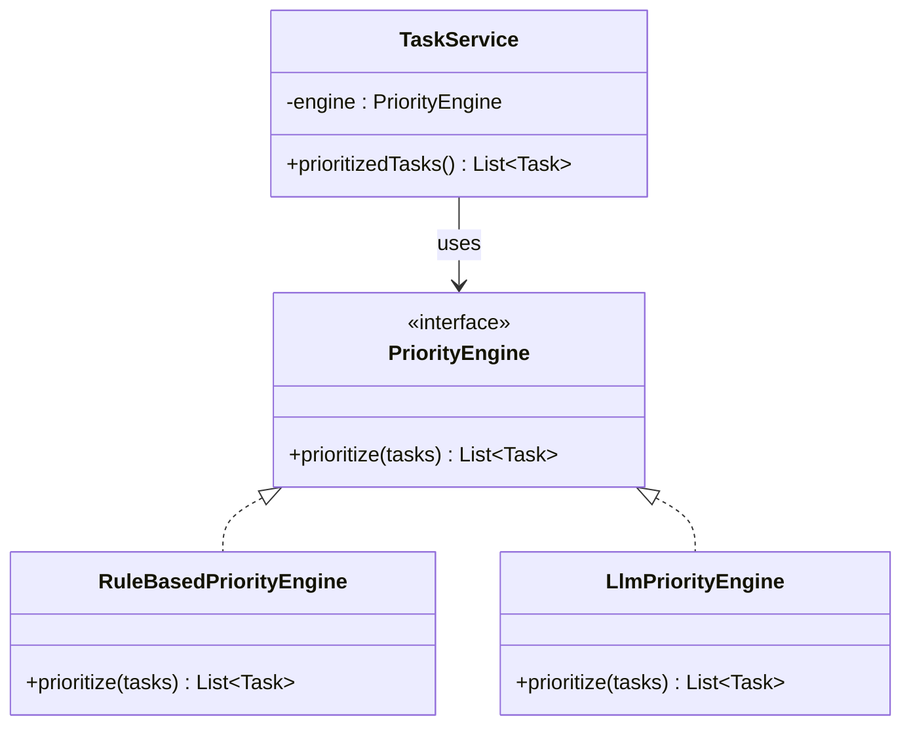

# Architecture — SmartTask

> 💡 **What this document is for:** it shows *how* the system is structured to satisfy the SRS.
> Judges look for a clean, layered design and sensible use of **design patterns**. Diagrams below
> use [Mermaid](https://mermaid.js.org/) — they render automatically on GitHub.

---

## 1. System Context (the big picture)


The student interacts with one app. Everything else is internal.

---

## 2. Layered Architecture (components)

We split the code into layers so each part has **one job** and can be tested in isolation.



**Rule of thumb:** arrows point *inward*, toward the Domain. The Domain (`Task`) knows nothing about
the outside world, which keeps it simple and easy to test.

---

## 3. Key Design Pattern — Strategy (for the AI engine)

This is the pattern Workshop 1 is about: **"design patterns for AI use cases."**

The `TaskService` never talks to a concrete engine. It talks to the **`PriorityEngine` interface**.
We can plug in any engine that implements it — a simple rule-based one today, a real LLM tomorrow —
**without touching `TaskService`**.



**Why this wins points:**
- **Testable** — in tests we can pass a fake engine and control the outcome (crucial for Day 2 TDD).
- **Extensible** — adding the LLM engine later touches *zero* existing code (satisfies NFR-3).
- **Vendor-neutral** — swapping OpenAI ↔ Anthropic ↔ local model is a one-line change.

> A second pattern is hiding here too: **Repository** (`TaskRepository` interface +
> `InMemoryTaskRepository`). It hides *where* tasks are stored, so we can move from memory to a
> database later without changing `TaskService`. Same idea, applied to storage.

---

## 4. The rule-based priority score (our "AI" for the MVP)

For each task we compute:

```
score = (importance × 20)  +  urgencyBonus(deadline)
```

where `urgencyBonus` is larger the sooner the deadline (e.g. overdue/today = high, far away = low).
Tasks are then sorted by score, highest first. It's simple, deterministic, and easy to test — and it
lives behind the `PriorityEngine` interface, so a smarter engine can replace the whole formula later.

> The exact formula and method signatures will be finalized on Day 2 **as we write the tests** —
> that's TDD: the tests pin down the behavior, then we make them pass.

---

## 5. Design Decisions (lightweight ADR)

| Decision | Why |
|----------|-----|
| In-memory storage for the MVP | Fastest path to a working demo; Repository pattern lets us upgrade later. |
| Strategy pattern for the engine | Directly satisfies the "swap the AI later" requirement (FR-4, NFR-3). |
| Layered architecture | Each layer is independently testable — essential for the Day 2 test suite. |
| Java + Maven + JUnit 5 | Industry-standard, great CI/CD support, matches the competition's tooling. |
